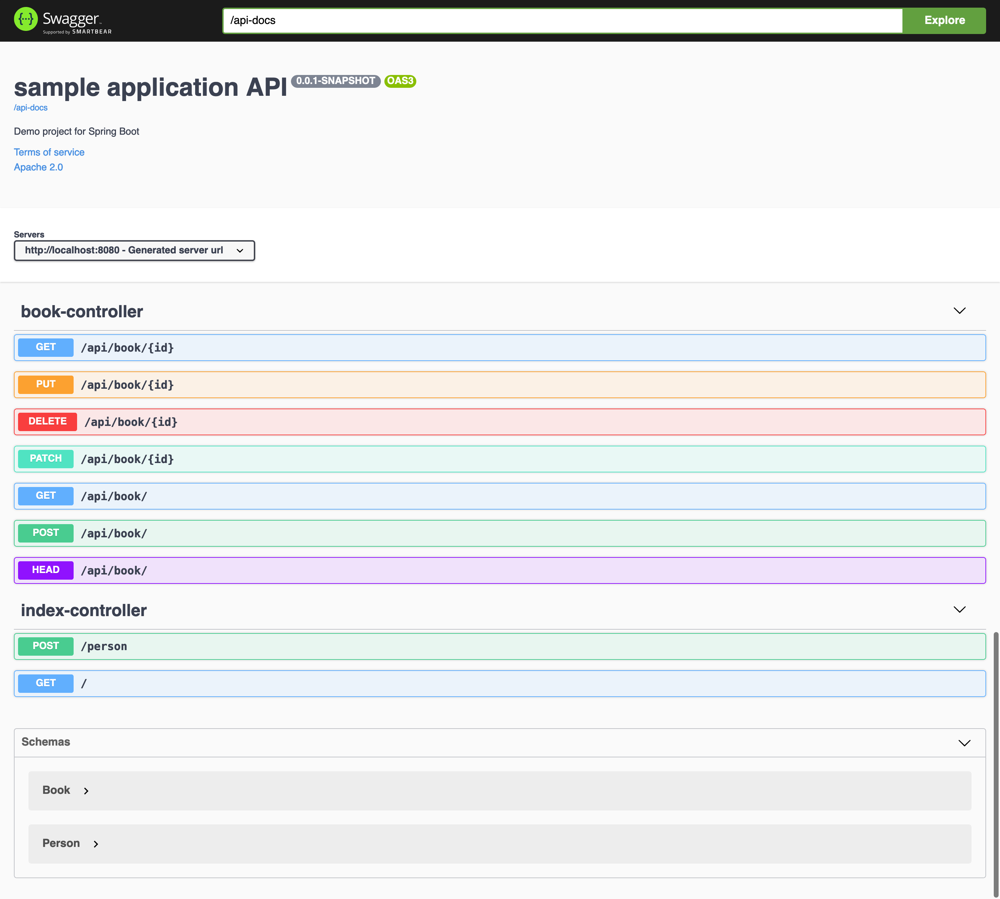

# springboot-springdoc

### Things todo list

1. Clone this repository: `git clone https://github.com/hendisantika/springboot-springdoc.git`
2. Navigate to the folder: `cd springboot-springdoc`
3. Run the application: `mvn clean spring-boot:run`
4. Open your favorite browser then type: http://localhost:8080/swagger-ui/index.html
5. Type `/api-docs` in explore text field

### Image Screen shot

Swagger UI Page

